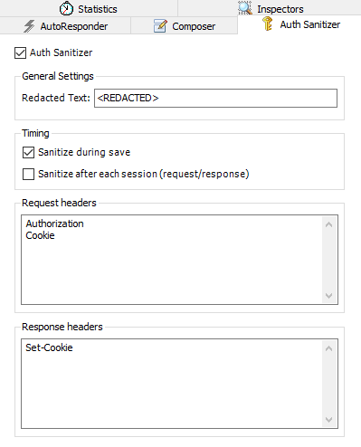

# Fiddler Auth Sanitizer

Fiddler Auth Sanitizer is an extension for Telerik Fiddler to assist with removing sensitive information from persisted logs.

## Building
This plugin can be built using VS2015 or later (or equivalent MSBuild command line build tools).  
A Fiddler installation is required. The project references Fiddler.exe at "$(LocalAppData)\Programs\Fiddler\Fiddler.exe", but the reference path can be changed if desired.

## Installation
1. Copy FiddlerSanitizer.dll into %UserProfile%\Documents\Fiddler2\Scripts
2. Launch Fiddler
3. Go to the "Auth Sanitizer" tab and configure as desired

## Please note

This tool is designed to remove authorization headers from the Telerik Fiddler trace logs, but it may not find or remove all of them.  The trace logs may still contain some sensitive information.  We recommend that you manually check the trace logs for authorization headers and any other sensitive information, prior to sharing.

## Contributing

This project welcomes contributions and suggestions.  Most contributions require you to agree to a
Contributor License Agreement (CLA) declaring that you have the right to, and actually do, grant us
the rights to use your contribution. For details, visit https://cla.microsoft.com.

When you submit a pull request, a CLA-bot will automatically determine whether you need to provide
a CLA and decorate the PR appropriately (e.g., label, comment). Simply follow the instructions
provided by the bot. You will only need to do this once across all repos using our CLA.

This project has adopted the [Microsoft Open Source Code of Conduct](https://opensource.microsoft.com/codeofconduct/).
For more information see the [Code of Conduct FAQ](https://opensource.microsoft.com/codeofconduct/faq/) or
contact [opencode@microsoft.com](mailto:opencode@microsoft.com) with any additional questions or comments.
